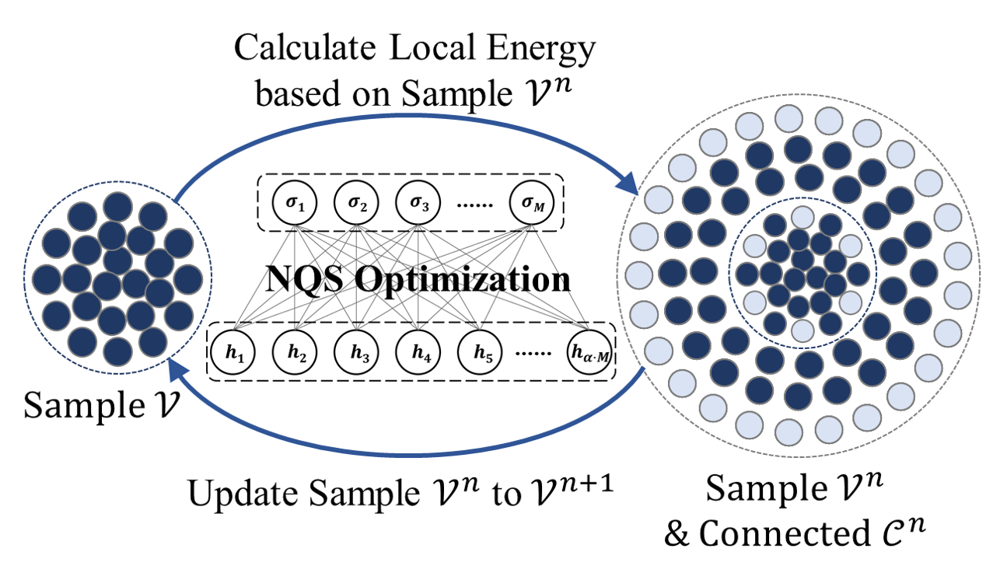

# SC_NQS
Neural-network Quantum States (NQS) harness the capabilities of neural networks to learn accurate ground-state wavefunctions via a variational Monte Carlo approach. This repository serves as the implementation of ["A Non-stochastic Optimization Algorithm for Neural-network Quantum States"](https://doi.org/10.48550/arXiv.2305.12776) [(https://doi.org/10.48550/arXiv.2305.12776)](https://doi.org/10.48550/arXiv.2305.12776), which relies on deterministic selected configurations (SC) during the energy evaluation and bypasses the inherent Monte Carlo (MC) sampling process. The code is primarily developed using [JAX](https://github.com/google/jax) and leverages [PySCF](https://github.com/pyscf/pyscf) to access electron integration for molecular calculations.



# Getting Started

1. Install requirements.

```
pip install -r requirements.txt
```

2. Compile cython codes.

```
python setup.py build_ext --inplace
```

3. Run example.

```
python test.py
```

The output result of test.py is the ground state energy of the $\rm C_2$ molecule(STO-3G basis) at equilibrium using the SC-NQS method.

# Giving Credit
If you use this code in your work, please cite the associated papers.

1. "A Non-stochastic Optimization Algorithm for Neural-network Quantum States" [(https://doi.org/10.48550/arXiv.2305.12776)](https://doi.org/10.48550/arXiv.2305.12776)
